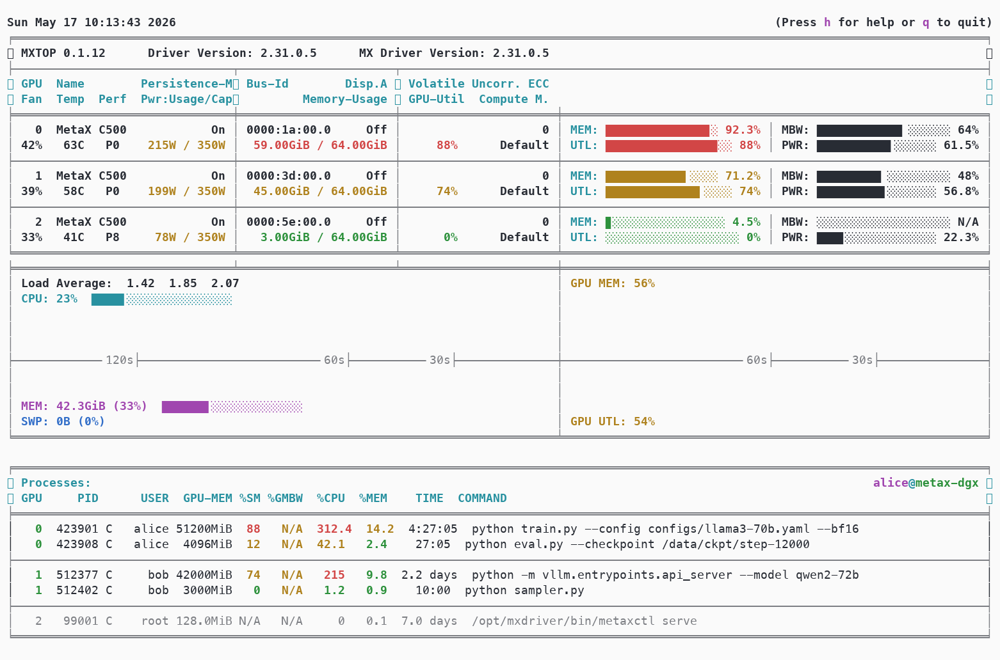
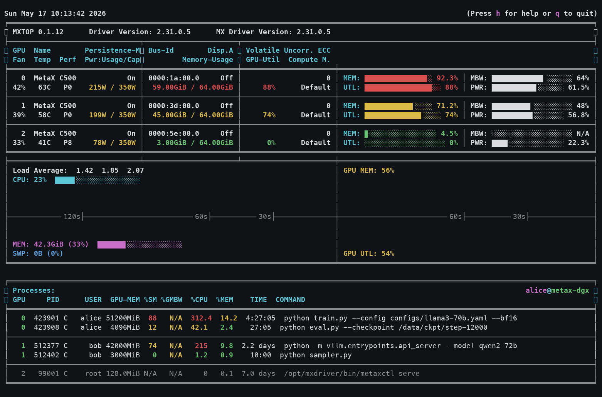

<h1 align="center">mxtop</h1>

<p align="center">
  <a href="https://github.com/onlylrs/metax-mxtop"></a>
  <a href="https://opensource.org/licenses/MIT"></a>
  
  
  
</p>

<p align="center">
  <code>mxtop</code> is an nvitop-like terminal monitor for MetaX GPUs. It shows live GPU
  temperature, power, utilization, memory use, and GPU processes from MetaX
  management tooling.
</p>

<p align="center">
  
  
</p>


## Install

Install directly from GitHub:

```bash
python -m pip install "git+https://github.com/onlylrs/metax-mxtop.git"
```

Or

```bash
git clone https://github.com/onlylrs/metax-mxtop.git
cd metax-mxtop
python -m pip install -e .
```

## Usage

Open the interactive terminal dashboard:

```bash
mxtop
```

Print one text snapshot:

```bash
mxtop --once
```

Print one JSON snapshot:

```bash
mxtop --json
```

Force a backend:

```bash
mxtop --backend pymxsml
mxtop --backend mxsmi
```

In the interactive UI, press `q`, `Q`, or `Esc` to exit.

## Backends

`mxtop` tries backends in this order:

1. `pymxsml`: imports an installed `pymxsml` package, or auto-loads the MetaX
   SDK wheel from `/opt/maca/share/mxsml/pymxsml-*.whl` or
   `/opt/mxn100/share/mxsml/pymxsml-*.whl`.
2. `mx-smi`: falls back to `mx-smi dmon --format csv` for device metrics and
   parses `mx-smi --show-process` for GPU process memory.

The `pymxsml` backend gives better device names and UUIDs. The `mx-smi` backend
is useful when the SDK wheel is missing or incompatible.

## Development

Run tests with:

```bash
uv run --with pytest --with psutil pytest -q
```

The package uses a `src/` layout and exposes the console script with
`[project.scripts]` in `pyproject.toml`.
