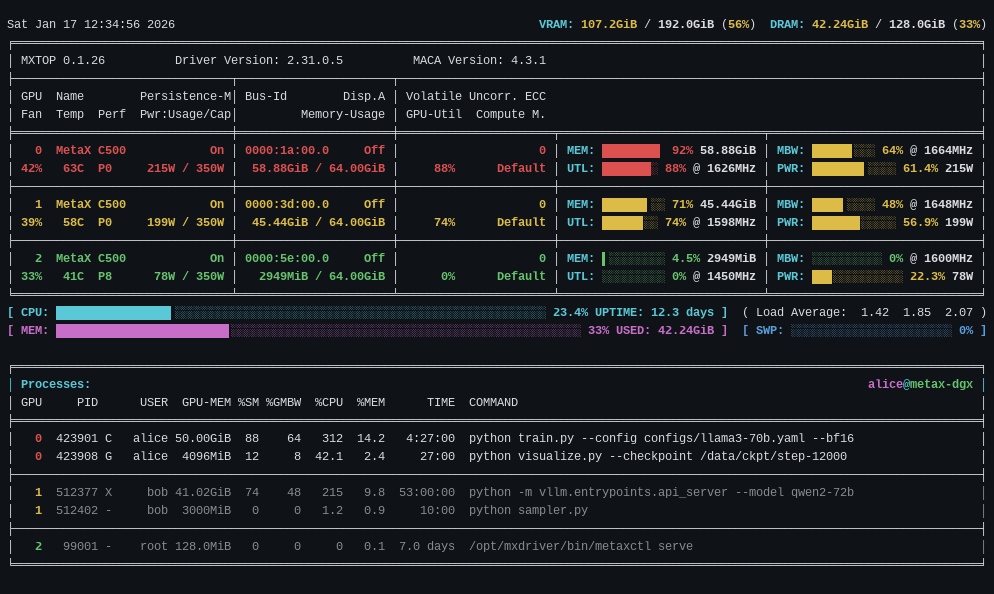
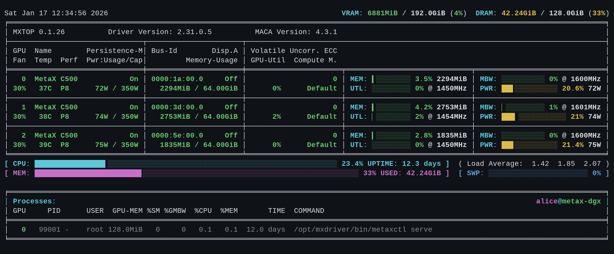
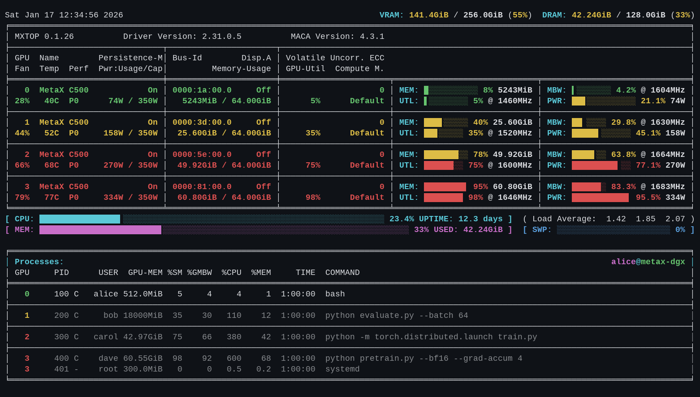
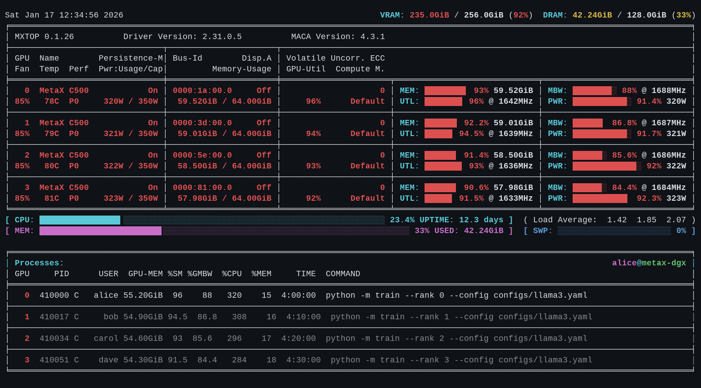
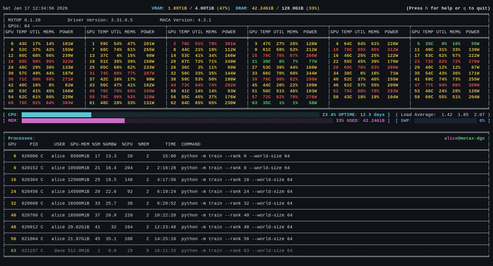

<h1 align="center">metax-mxtop</h1>

<p align="center">
  <a href="https://github.com/linkedlist771/metax-mxtop"></a>
  <a href="https://pypi.org/project/metax-mxtop/"></a>
  <a href="https://opensource.org/licenses/MIT"></a>
  
  
  
</p>

<p align="center">
  <code>metax-mxtop</code> is an nvitop-like terminal monitor for MetaX GPUs. Install the PyPI package, then run the <code>mxtop</code> command.
</p>

<p align="center">
  <em>Built upon <a href="https://github.com/onlylrs/metax-mxtop">onlylrs/metax-mxtop</a>, with thanks to the original project for the foundation.</em>
</p>

<p align="center">
  
</p>

<p align="center"><em>Colors follow nvitop's intensity model: each device summary uses its dominant GPU or memory load, while the detailed <code>MEM</code> / <code>MBW</code> / <code>UTL</code> / <code>PWR</code> bars retain metric-specific colors (memory thresholds <code>10/80</code>, GPU thresholds <code>10/75</code>).</em></p>

<table align="center">
  <tr>
    <td align="center"><strong>Idle</strong> — light load, mostly green</td>
    <td align="center"><strong>Mixed</strong> — per-bar color bands</td>
    <td align="center"><strong>Heavy</strong> — saturation across the cluster</td>
  </tr>
  <tr>
    <td></td>
    <td></td>
    <td></td>
  </tr>
</table>

<p align="center"><em>Hosts with up to 16 GPUs retain the detailed nvitop-style list. Larger 32/64-GPU fleets use an adaptive overview grid in auto, compact, and one-shot views, while full mode keeps every detailed field.</em></p>

<p align="center">
  
</p>

## Features

- nvitop-like terminal dashboard for MetaX GPUs, with full, compact, and automatic layouts.
- Read-only GPU telemetry through MXSML/Pymxsml or `mx-smi`.
- GPU device panel with temperature, power, utilization, memory, memory bandwidth, clocks, bus id, persistence, performance state, and driver fields when available.
- Adaptive 32/64-GPU fleet grid that preserves per-device load colors and leaves substantially more room for host/process data.
- Host panel with load average and scrolling history graphs for CPU, memory, swap, and the selected GPU's memory/utilization.
- Process table with selection, multi-process tagging, vertical and horizontal scrolling, and nvitop-compatible sorting.
- Process environment, host/GPU process-tree, per-process metrics, and built-in help screens.
- Confirmed `SIGINT`, `SIGTERM`, and `SIGKILL` actions for selected host processes, with `--readonly` to disable every process-changing action.
- ANSI-colored one-shot output, curses colors, ASCII fallback, and JSON output from the same filtered snapshot model.
- Shared device, user, PID, visibility, compute, and graphics filters across TUI, text, and JSON output.

GPU management remains read-only: `mxtop` does not update firmware, reset GPUs, or change persistence/admin settings. Interactive process signals are always presented for confirmation, validate process identity to guard against PID reuse, and enforce process ownership unless `mxtop` is running as root. Use `--readonly` when even confirmed host-process actions must be unavailable.

## Install

From PyPI:

```bash
pip install -U metax-mxtop
```

The installed command is:

```bash
mxtop
```

From source:

```bash
git clone https://github.com/linkedlist771/metax-mxtop.git
cd metax-mxtop
pip install -e .
```

## MetaX backend discovery

`mxtop` tries backends in this order when `--backend auto` is used:

1. Pymxsml/MXSML, when importable and usable.
2. `mx-smi`, when the CLI is available.

For the `mx-smi` backend, the executable path is resolved in this order:

1. Explicit backend path when constructed by callers.
2. `MXTOP_MXSMI_PATH` environment variable.
3. `/opt/mxdriver/bin/mx-smi`.
4. `mx-smi` from `PATH`.

Example:

```bash
MXTOP_MXSMI_PATH=/opt/mxdriver/bin/mx-smi mxtop --backend mxsmi
```

## Usage

On a terminal, the default command opens the interactive dashboard:

```bash
mxtop
```

Use `--monitor` / `-m` to request it explicitly or choose a layout:

```bash
mxtop -m
mxtop -m full
mxtop -m compact
```

An explicit monitor requires both stdin and stdout to be TTYs. When the default command is redirected or piped, it prints one snapshot instead. `--once` / `-1` always selects one-shot text output:

```bash
mxtop --once
```

ANSI color is enabled for a terminal and can be disabled or forced:

```bash
mxtop --once --no-color
mxtop --once --force-color
```

`--json` prints one machine-readable snapshot without ANSI styling:

```bash
mxtop --json
```

Common filters:

```bash
mxtop --only 0 1
mxtop --only-visible
mxtop --user alice bob
mxtop --user                 # current user
mxtop --pid 1234 5678
mxtop --compute
mxtop --only-compute
mxtop --graphics
mxtop --only-graphics
```

`--compute` and `--graphics` include processes with those contexts, including mixed `X` / `C+G` processes. Their uppercase `--only-*` forms require an exact compute-only or graphics-only type. Multiple supplied filters are combined.

Backend and layout options:

```bash
mxtop --backend auto
mxtop --backend pymxsml
mxtop --backend mxsmi
mxtop --interval 1.0
mxtop --no-unicode
mxtop --readonly
```

Useful CLI flags:

| Flag | Meaning |
| --- | --- |
| `--version`, `-V` | Print the runtime version. |
| `--backend {auto,pymxsml,mxsmi}` | Select telemetry backend. |
| `--interval SECONDS` | Refresh interval (default `2.0`, minimum `0.25`). |
| `--once`, `-1` | Print one text snapshot and exit. |
| `--monitor`, `-m [auto\|full\|compact]` | Run interactively, optionally choosing the layout. |
| `--json` | Print one JSON snapshot and exit. |
| `--no-color` | Disable ANSI colors in text output. |
| `--force-color` | Emit ANSI colors even when stdout is not a TTY. |
| `--colorful` | Use spectrum-like gradient colors for bar charts. |
| `--light` | Use colors suitable for a light terminal theme. |
| `--gpu-util-thresh LOW HIGH` | Override GPU utilization intensity thresholds. |
| `--mem-util-thresh LOW HIGH` | Override GPU-memory intensity thresholds. |
| `--only INDEX...`, `-o INDEX...` | Show only selected GPU indices and their processes. |
| `--only-visible`, `-ov` | Follow `MACA_VISIBLE_DEVICES` or `CUDA_VISIBLE_DEVICES`. |
| `--user [USER...]`, `-u [USER...]` | Show selected users; with no value, use the current user. |
| `--pid PID...`, `-p PID...` | Show only selected process IDs. |
| `--compute`, `-c` | Require a compute-capable process context. |
| `--only-compute`, `-C` | Require an exact compute-only process context. |
| `--graphics`, `-g` | Require a graphics-capable process context. |
| `--only-graphics`, `-G` | Require an exact graphics-only process context. |
| `--no-unicode`, `--ascii`, `-U` | Use ASCII characters only. This is automatic for non-UTF-8 locales. |
| `--readonly` | Disable process signals in the interactive UI. |

### Environment variables

| Variable | Meaning |
| --- | --- |
| `MXTOP_MXSMI_PATH` | Override the local `mx-smi` executable discovered by the backend. |
| `MXTOP_MONITOR_MODE` | Comma-separated defaults: one of `auto`, `full`, `compact`, plus `colorful`/`plain`, `light`/`dark`, and/or `readonly`. Explicit CLI options take precedence. |
| `MXTOP_GPU_UTILIZATION_THRESHOLDS=LOW,HIGH` | Set GPU utilization thresholds when the CLI option is omitted. |
| `MXTOP_MEMORY_UTILIZATION_THRESHOLDS=LOW,HIGH` | Set GPU-memory thresholds when the CLI option is omitted. |
| `MACA_VISIBLE_DEVICES` | Device indices, UUID prefixes, or BDF prefixes used by `--only-visible`. |
| `CUDA_VISIBLE_DEVICES` | Fallback visibility list when `MACA_VISIBLE_DEVICES` is not set. |
| `ANSI_COLORS_DISABLED` | Disable ANSI output unless `--force-color` is explicit. |
| `NO_COLOR` | Disable ANSI output unless `--force-color` is explicit. |
| `FORCE_COLOR` | Force ANSI output when neither disable variable is present. |

## Remote mode (cluster dashboard)

Aggregate several SSH-reachable nodes into one local web dashboard:

```bash
pip install 'metax-mxtop[remote]'        # pulls in asyncssh
mxtop --remote-mode --nodes nodeA nodeB nodeC --open
# or list hosts in a file (one per line, # comments allowed)
mxtop --remote-mode --nodes-file ~/hosts.txt --port 8080
```

- Host names are plain SSH aliases resolved from your `~/.ssh/config`
  (HostName/User/Port/IdentityFile/ProxyJump all honoured), so nodes with
  different MetaX card configurations work without extra setup.
- Authentication uses your SSH keys / `ssh-agent` — the "login once" model.
  For password-only nodes, run `ssh-copy-id` first; mxtop does not store
  passwords.
- The dashboard polls every node concurrently (`--interval`, default 2s),
  serves on `127.0.0.1` by default (`--bind` to change), and streams live
  updates over Server-Sent Events. Unreachable nodes are shown as down
  instead of breaking the page.
- Each node runs the same `mx-smi` queries as the local backend; override the
  remote binary with `--remote-mxsmi-path` if it is not on `PATH`.

## Interactive keys

### General and navigation

| Key | Action |
| --- | --- |
| `q`, `Q` | Quit from the main screen; return from a detail screen. |
| `h`, `?` | Open help. Any key returns to the previous screen. |
| `r`, `R`, `Ctrl-R`, `F5` | Refresh immediately. On the main screen this also resets selection and scrolling. |
| `a`, `f`, `c` | Switch to auto, full, or compact layout. |
| Up/Down, `Shift-Tab`/`Tab`, `Alt-k`/`Alt-j` | Select the previous/next process or detail row. |
| `Home`, `End` | Select the first/last row. |
| `Space` | Tag or untag the current process, then advance. Tagged processes form the action target set. |
| `Esc` | Clear the main-screen selection and tags; return from environment or metrics. It does not quit mxtop. |
| `PageUp`/`PageDown`, `[`/`]` | Scroll the viewport vertically; `Alt-K`/`Alt-J` are main-screen aliases. |
| Left/Right, `Alt-h`/`Alt-l` | Scroll horizontally. |
| `Ctrl-A`, `^` | Return to the leftmost column. |
| `Ctrl-E`, `$` | Jump to the rightmost process-table column. |
| Mouse wheel | Move vertically; hold Ctrl for 5x movement or Shift for horizontal movement. Click a row to select it. |

### Screens and process actions

| Key | Action |
| --- | --- |
| `e` | Show the selected process environment. Press `e`, `q`, or `Esc` to return. |
| `t` | Show the GPU process tree, including related host ancestors and descendants. Press `t` or `q` to return. |
| `Enter` | Show rolling metrics for the selected process. Press `Enter`, `q`, or `Esc` to return. |
| `T` | Open confirmation for `SIGTERM`. |
| `K`, `k` | Open confirmation for `SIGKILL`. |
| `Ctrl-C`, `I` | Open confirmation for `SIGINT`. Ctrl-C does not quit the TUI. |

Signals apply to all tagged processes when tags exist, otherwise to the selected process (or highlighted process-tree entry). The dialog supports Left/Right, Tab/Shift-Tab, `,`/`.`, mouse wheel, and button clicks; choose `SIGTERM`, `SIGKILL`, `SIGINT`, or Cancel, then confirm with `Enter` or `Space`. Process actions require `psutil` and are disabled by `--readonly`.

### Process sorting

| Key | Action |
| --- | --- |
| `,`, `<` / `.`, `>` | Cycle to the previous/next sort column. |
| `/` | Invert the current sort order. |
| `on` / `oN` | Sort by GPU index in normal/reverse order. |
| `op` / `oP` | Sort by PID in normal/reverse order. |
| `ou` / `oU` | Sort by user in normal/reverse order. |
| `og` / `oG` | Sort by GPU memory in normal/reverse order. |
| `os` / `oS` | Sort by GPU utilization in normal/reverse order. |
| `ob` / `oB` | Sort by GPU memory-bandwidth utilization in normal/reverse order. |
| `oc` / `oC` | Sort by CPU utilization in normal/reverse order. |
| `om` / `oM` | Sort by host-memory utilization in normal/reverse order. |
| `ot` / `oT` | Sort by runtime in normal/reverse order. |

## Packaging and releases

The PyPI distribution name is `metax-mxtop`; the Python import package and CLI command are both `mxtop`.

```bash
pip install metax-mxtop
mxtop --version
```

Release automation is tag-driven:

1. Bump `pyproject.toml`, `src/mxtop/__init__.py`, and the local package entry in `uv.lock`.
2. Regenerate the preview, gallery, and showcase assets and run their `--check` commands.
3. Run the full test, lint, and package-build commands below.
4. Commit the change.
5. Create a new semver tag, for example `v0.1.22`.
6. Push the commit and that tag.

GitHub Actions then builds the wheelhouse, creates or updates the GitHub Release, and publishes the package to PyPI through Trusted Publishing for `v*` tags.

## More previews

See [GALLERY.md](GALLERY.md) for a tile of rendered stdout across common CLI parameter combinations — colour palettes, layout modes, filters, custom intensity thresholds, multi-GPU layouts, and JSON output.

## Development

Run tests and lint locally:

```bash
uv run --locked --with pytest --with psutil --with pillow pytest -q
uv run --locked --with ruff ruff check .
uv run --locked --with build python -m build
```

More background is available in [INTRO.md](INTRO.md).
