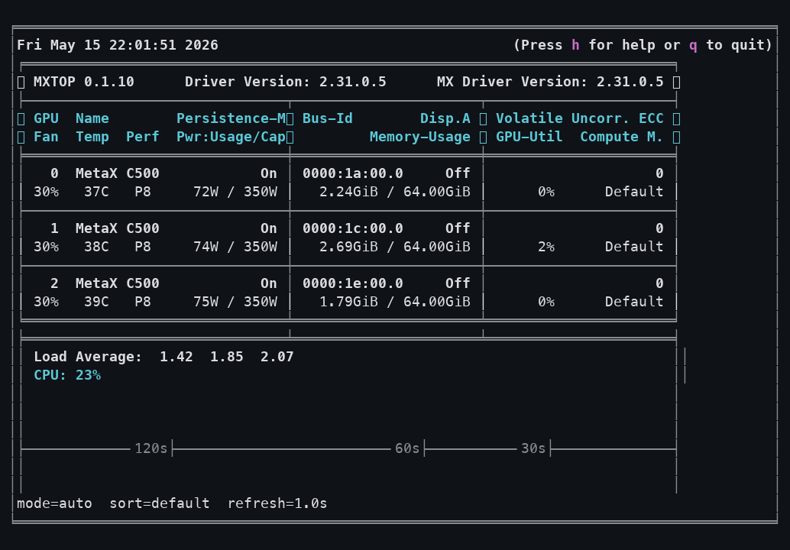
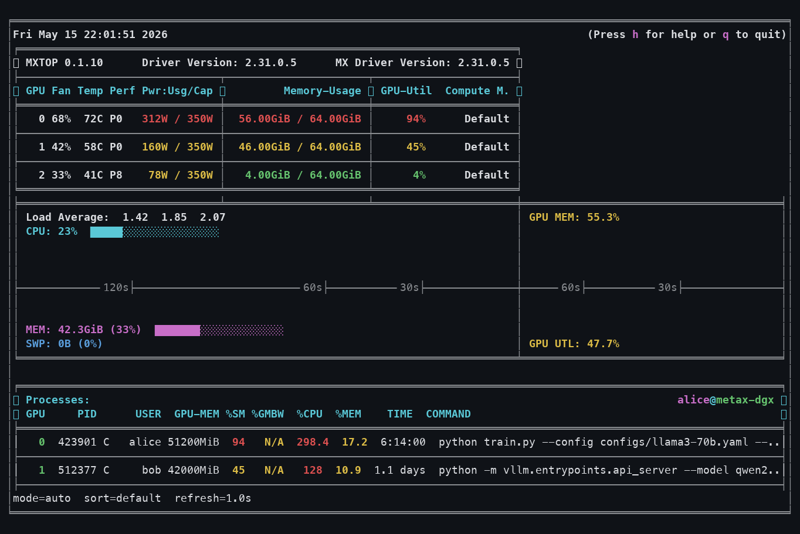
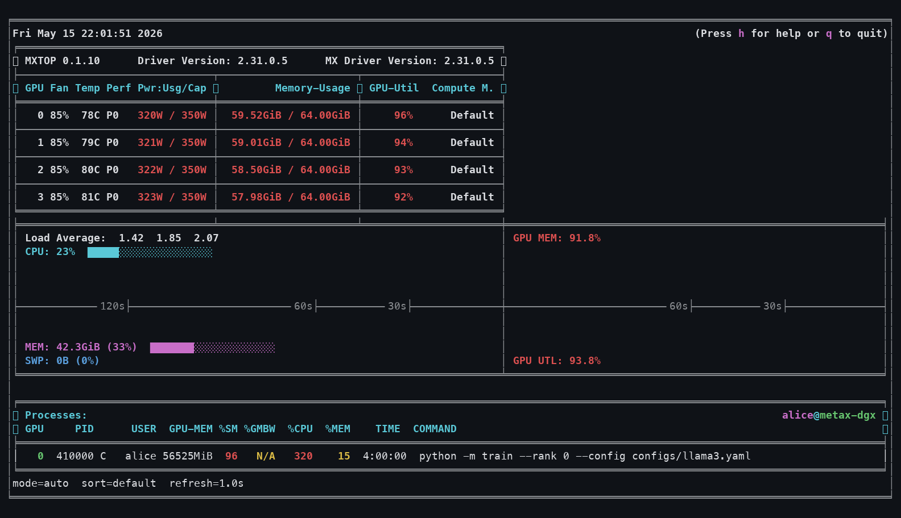
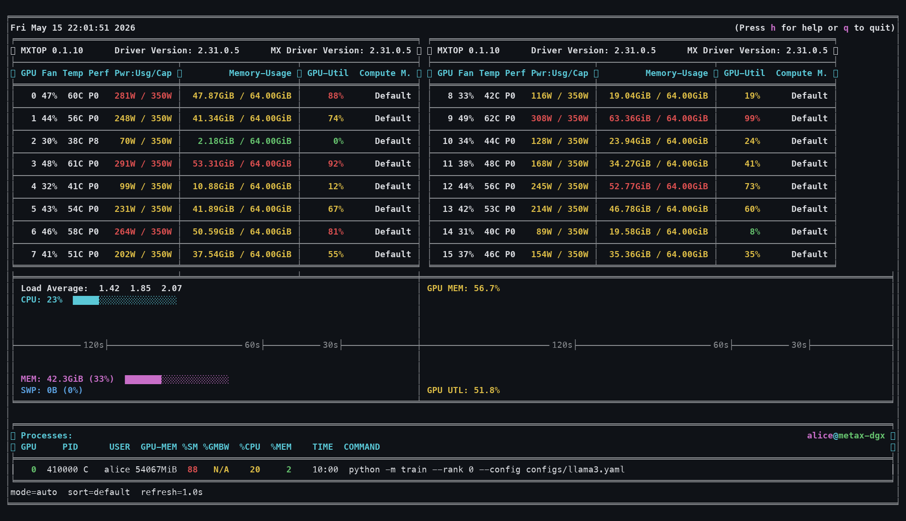
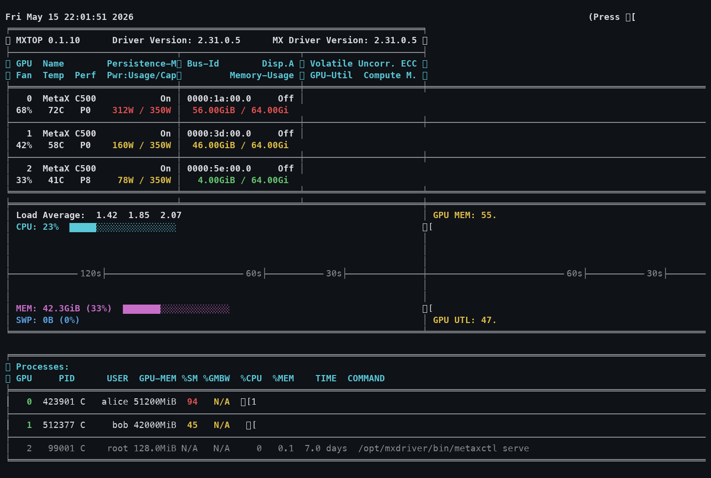
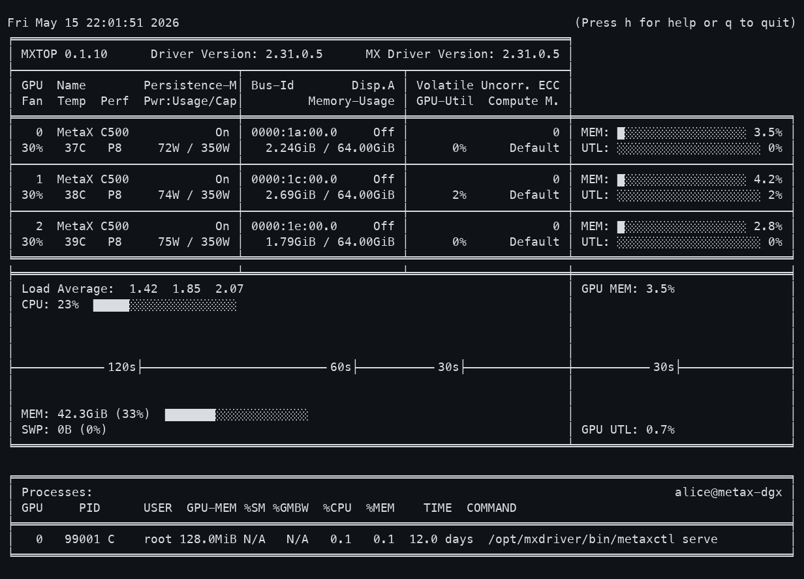
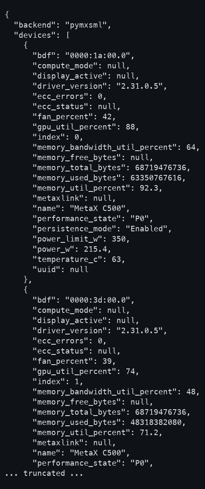

# mxtop Preview Showcase

The screenshots below use deterministic sample telemetry so layout, GPU count,
and output mode can be compared side by side.

## Interactive TUI

| Scenario | Preview |
| --- | --- |
| 92x28 terminal, 3 idle GPUs |  |
| 122x36 terminal, 3 mixed-load GPUs |  |
| 142x36 terminal, 4 heavy-load GPUs |  |
| 172x44 terminal, 16-GPU compact layout |  |

## Command Output

| Scenario | Preview |
| --- | --- |
| `mxtop --once`, colored mixed-load output |  |
| `mxtop --once --no-color`, plain idle output |  |
| `mxtop --json`, truncated JSON snapshot |  |
