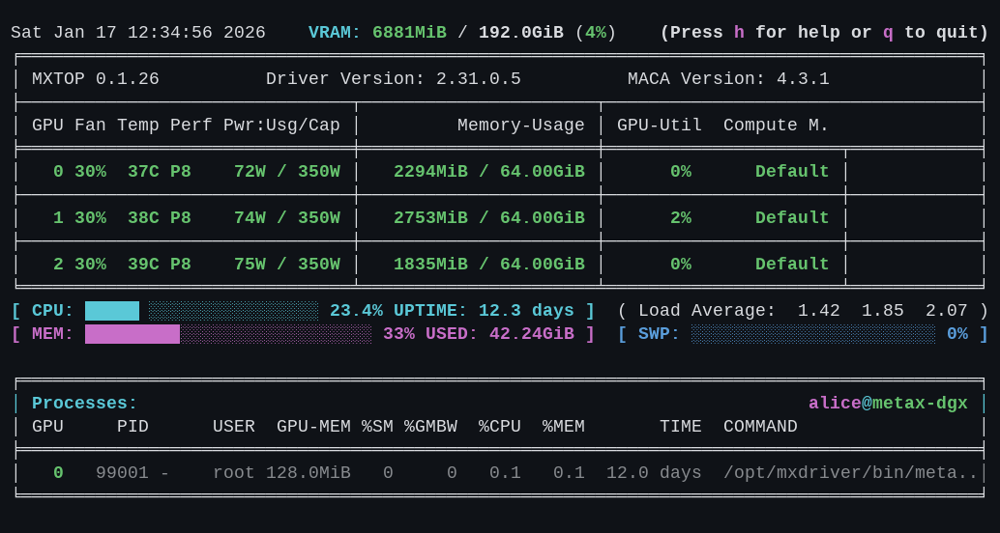
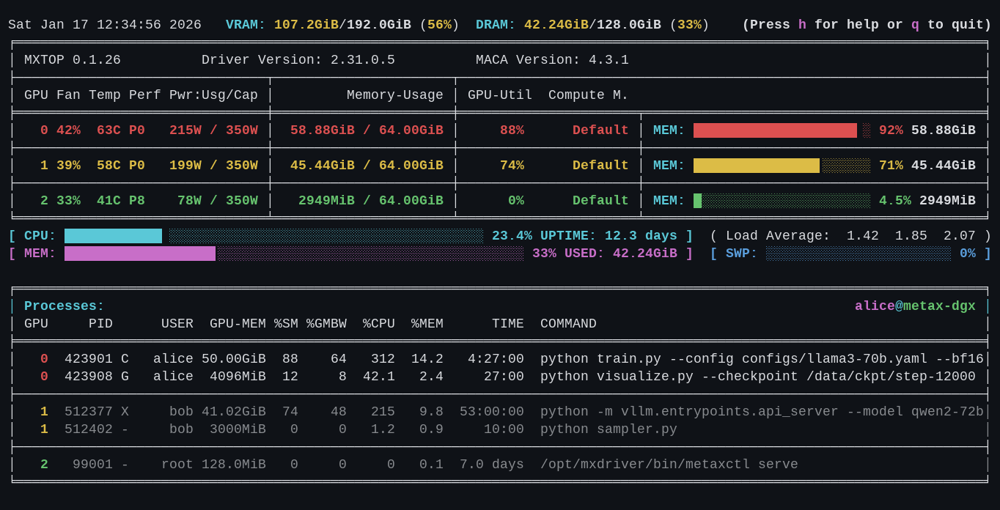
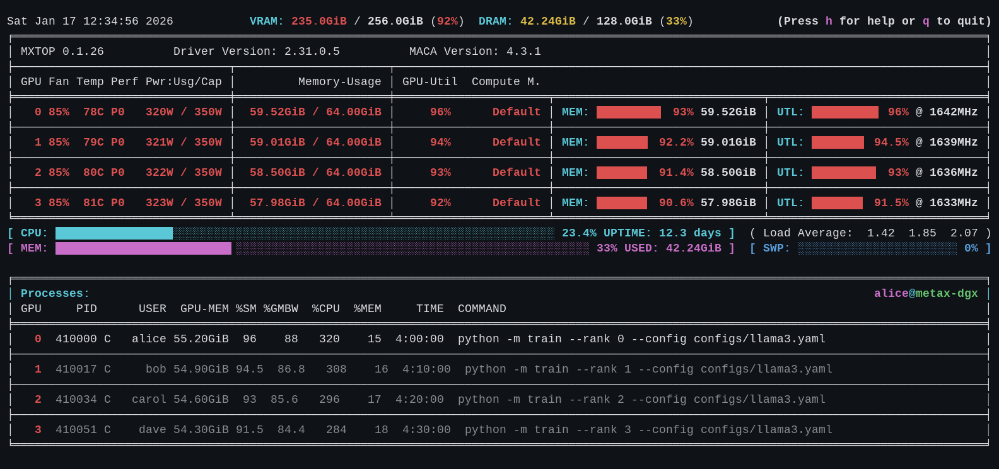
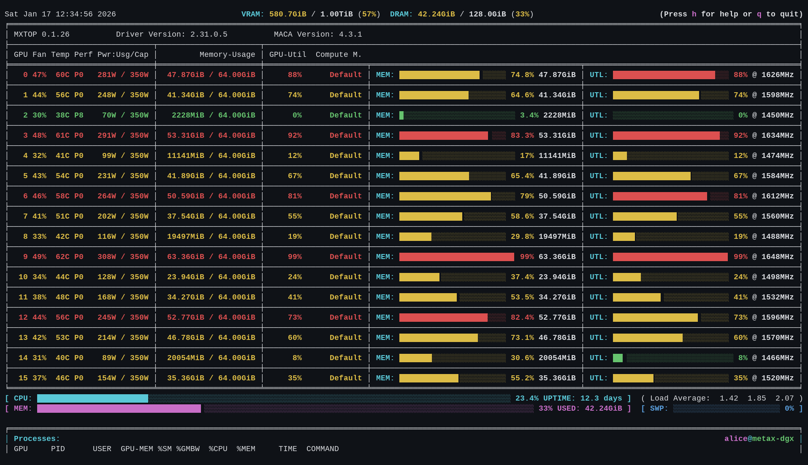
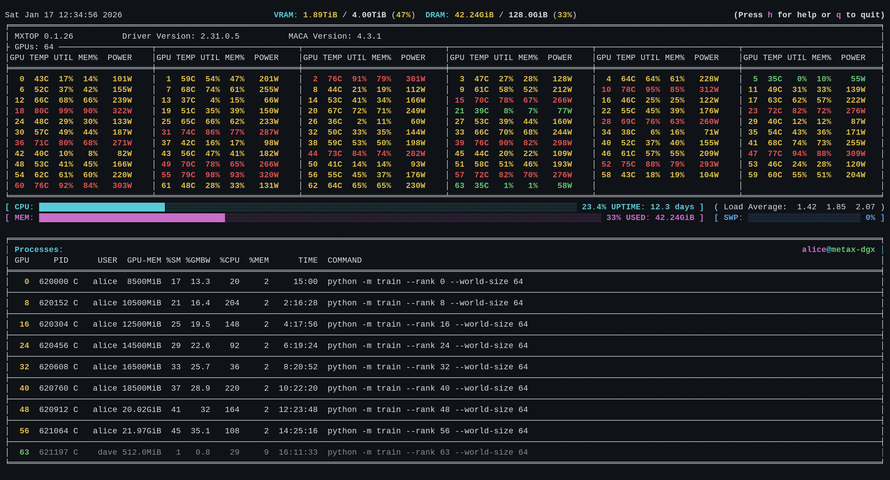
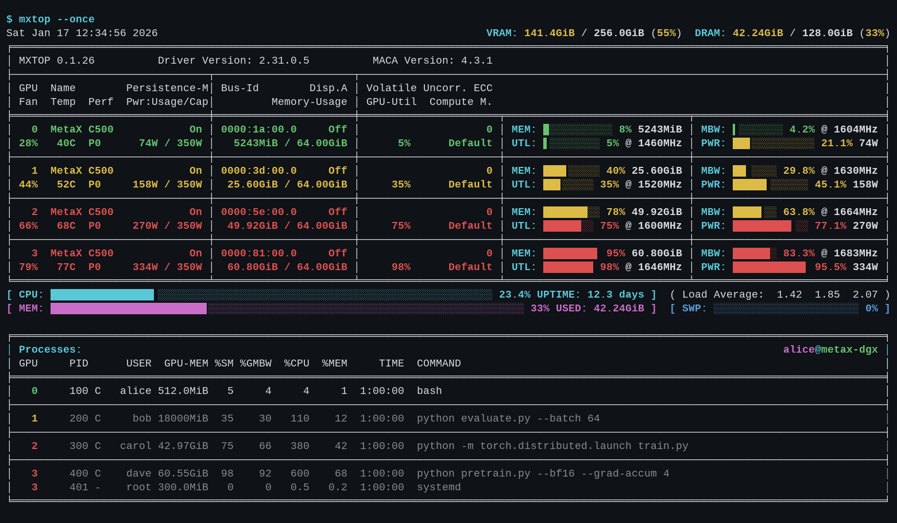
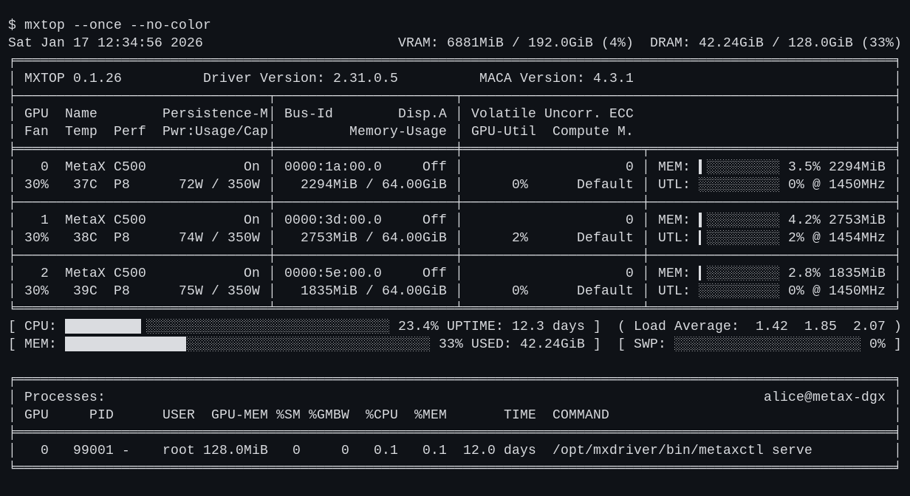
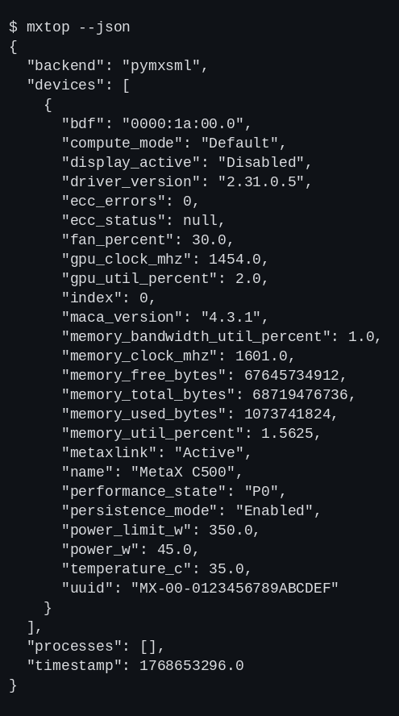

# mxtop Preview Showcase

These screenshots use the same fixed-time canonical MetaX telemetry as the CLI gallery. Each PNG embeds a digest of its rendered source text.

Re-render with ``uv run --locked --with pillow --with psutil python scripts/render_showcase.py``; add ``--check`` to verify freshness.

## Interactive TUI

| Scenario | Preview |
| --- | --- |
| 92x28 viewport, 3 idle GPUs |  |
| 122x36 viewport, 3 mixed-load GPUs |  |
| 142x36 viewport, 4 heavily loaded GPUs |  |
| 172x44 viewport, 16 mixed-load GPUs |  |
| 180x44 viewport, 64-GPU fleet overview |  |

## Command Output

| Scenario | Preview |
| --- | --- |
| `mxtop --once` Colored one-shot mixed-load output |  |
| `mxtop --once --no-color` Uncolored one-shot idle output |  |
| `mxtop --json` Complete JSON output from a one-GPU fixture |  |
